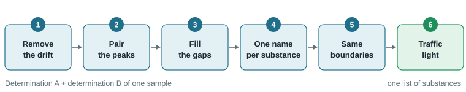
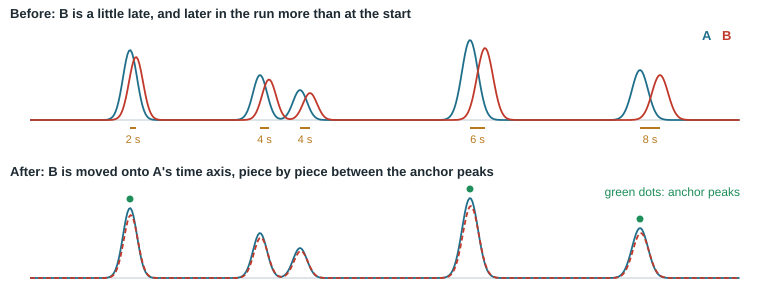
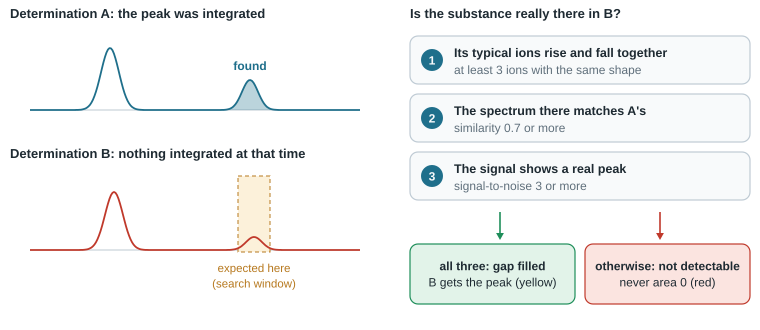
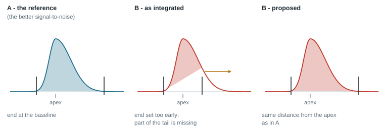

# How the double determination works

A sample is injected twice: determination **A** and determination **B**. Each run is integrated and searched
in the libraries on its own, so two peak lists come out that *almost* agree. The same substance elutes a few
seconds apart, gets slightly different integration boundaries, is just above the threshold in A and just below
it in B, or is named after one isomer in A and after its neighbour in B.

**Compare** in the **Double determination** tab of the **Replicates / results** panel turns the two lists into
*one* list of substances, makes them consistent where the data allow it, and marks what is left for you to
decide. This is what "harmonising" the two determinations means. This chapter explains the six steps.

Determination A is the reference: times are given on A's time axis. The peaks compared are those of the
detector chosen for the quantification (**Quantification** panel, **Detector**: FID or TIC).

## Which spectra are compared

Whether two peaks are the same substance is decided by their retention time *and* by their mass spectra.
A peak's spectrum still contains a little column bleed and noise, and these differ from injection to
injection. So only the ions that really belong to the peak are compared: the ions whose signal **rises and
falls together with the peak**. An ion from column bleed is flat and drops out.

If fewer than {{Features.min_ions}} such ions are left, the spectrum is too weak to compare and the retention
time alone decides. The list then says *paired by retention time*.

## Step 1 - Remove the drift

Two injections never elute at exactly the same times, and the difference is often not the same over the
whole run. A fixed time window would then either miss pairs late in the run or pair neighbours early in it.
So the drift is measured and removed first.

1. **The overall shift.** The largest peaks of both runs are compared, and the time difference that fits
   most of them is taken. Differences up to **Largest drift** ({{Features.max_shift}} min) are considered.
2. **Anchors.** Peaks that clearly belong together - only one possible partner and very similar spectra
   (similarity {{Features.anchor_sim}} or more) - become anchor points.
3. **The time map.** Between the anchors, B's times are moved onto A's time axis piece by piece. Anchors
   that do not fit their neighbours are left out, so one odd peak cannot bend the map.

The line above the list shows the shift that was found, for example *B: drift +4.2 s (61 peak pairs)*.

## Step 2 - Pair the peaks

Every peak of B is now compared with the peaks of A that lie within the **Retention time tolerance**
({{Features.rt_tol}} min) of it. Each possible pair gets a score from two parts:

- how close the retention times are (full marks at the same time, none at the edge of the tolerance);
- how similar the spectra are, from 0 to 1. This part counts twice as much as the time.

Below **Same substance from similarity** ({{Features.min_sim}}) two peaks are not a pair at all.

The program then chooses the set of pairs with the highest total score in which **no two pairs cross**: the
elution order of substances does not change between two injections, so peak 5 of A can never belong to
peak 7 of B while peak 6 of A belongs to peak 6 of B.

Three special cases are marked for you, all of them red:

| Marked as | What was found |
|---|---|
| **Spectra differ** | Two peaks at exactly the same time (within {{Features.exact_rt}} min) whose spectra do not match. It is one peak, but probably not one substance: a co-elution in one of the runs. |
| **Check pairing** | Another peak would have fitted almost as well. |
| *integrated as one peak in one determination and as two in the other* | A peak of A covers the place of two peaks of B (or the other way round). |

A peak without a partner stays in the list with an empty place for the other determination. Step 3 deals
with it.

Every substance of the list gets an **id** (F-001, F-002, ...). The id stays with the substance when you
integrate again or compare again.

## Step 3 - Fill the gaps

A peak found in A but not in B is very often present in B as well - just a little below the integrator's
threshold, or with a slightly different shape. Reporting it as "only in A" would lose a real substance.
Integrating whatever is at that time in B would invent one. So the program looks for evidence.

**Where to look.** The time map tells where the peak must be in B. The search window is half a peak width
either side of that time (at least 0.02 min). If B already has a peak there, no gap is filled: either it
is a different substance, or the missing peak lies inside a larger one.

**The three checks.**

1. **The typical ions co-elute.** The most characteristic ion of the substance must show a peak in the window,
   and of the substance's five typical ions at least {{Features.gap_min_ions}} must rise and fall together.
2. **The spectrum matches.** The spectrum at that point in B, compared with the spectrum of the peak found in
   A, must reach a similarity of {{Features.gap_min_cos}}.
3. **The signal shows a peak.** The quantification signal (FID or TIC) must have a maximum there with a
   signal-to-noise ratio of at least {{Features.gap_min_sn}}.

**If all three hold**, the peak is integrated in B. Its boundaries are taken from the peak in A - the same
distance before and after the apex - then moved to the nearest dip of the signal, and never into a
neighbouring peak. The row turns **yellow** with the verdict *Check: gap fill*, and the evidence is written
next to it, for example *ions 149/167/279 co-elute, similarity 0.91, S/N 12*.

**If not**, the place stays empty and says why: *not detectable: only 1 of 5 ions co-elute*, or
*not detectable: S/N 1.8 < 3*. The substance is **red** (*Only in A*) and is not reported unless you decide
otherwise. "Not detectable" is never reported as an area of zero.

**Without a usable spectrum** (no MS data, or too few co-eluting ions in A) only check 3 can be made. It is
then stricter: the maximum must lie close to the expected time and reach at least
{{Features.gap_min_fraction %}} of the height expected from A. The evidence then says *FID only*.

A gap fill is an ordinary manual integration event: it appears under **Manual events** in the
**Integration method** panel, is written to the audit trail, and can be undone.

## Step 4 - One name per substance

Both determinations were searched in the libraries separately, and similar compounds (isomers, homologues)
easily swap places at the top of two hit lists. Taking each determination's first hit would turn one peak
into two "substances". So the two hit lists are read together.

| Case | Situation | Result |
|---|---|---|
| **A** | Both determinations have the same first hit. | That name. Green. |
| **B** | The first hits differ, but one candidate is clearly the best over both. | That name for both determinations. Yellow: *Check: name by consensus*. |
| **C** | The first hits differ and no candidate leads clearly. | Both names, "name 1 / name 2", status *Manual review*. Yellow: *Check: 2 candidates*. Right-click the row and choose **Name: ...** to decide. |
| **D** | The spectra of the two determinations differ (see step 2). | No common name: *Conflict; manual review*. Red. |

For case **B** the program builds a **consensus spectrum**: the average of the two spectra, each scaled to
its largest ion. This cleaner spectrum is searched in the libraries again. Its first hit is taken when it

- leads the next candidate by at least **A name must lead by** ({{Features.id_margin}} score points),
- is among the first three hits of *each* determination, and
- reaches the quality limit (the NIAS parameter **Quality threshold**, 70 unless changed).

If the retention index is known (alkane ladder) and the library entry has one, a candidate whose index fits
within {{Features.ri_tol}} units gets a better score.

Two things always win over this: a name **you** typed, and an **internal standard**.

Where a determination's own first hit was not the chosen one, its identification is changed to the chosen
name, so that the peak table, the report sheets of each determination and the double determination all say
the same.

## Step 5 - The same boundaries

Two runs integrated with the same method still get slightly different peak boundaries: a little more tailing
in one, a valley found one data point earlier in the other. That alone can make the areas differ by more
than the accepted difference.

The determination with the better signal-to-noise ratio is the reference for a substance. The proposal is to
give the other determination's peak **the same distance from the apex** to its start and to its end.

This sounds right in general, but in crowded parts of a chromatogram it makes things worse: there the
boundaries are valleys shared with the neighbours. So a change is only proposed when all of this holds:

- the boundary is a **baseline boundary**, not a valley shared with a neighbour;
- the new boundary does not reach into a neighbouring peak;
- the boundaries really differ (by more than a quarter of the peak width);
- with the new boundaries the areas of A and B agree **at least 10 % better** than before. "Agree" is
  measured against the typical ratio of all pairs of the two runs, because one injection is often a little
  larger overall.

In the panel these are **proposals**. The row is yellow with *Check: boundaries*. Right-click the row and
choose **Harmonise the boundaries** to take one over, or press **Harmonise boundaries** below the list for
all of them - one undo step. The automation (watcher) applies
them by itself and lists them with the report.

## Step 6 - The traffic light

Every substance gets a colour, so that you only have to look at the exceptions.

| Colour | Meaning | What you do |
|---|---|---|
| **Green** | Found in both determinations, same substance, one name, difference within the limit. Verdict: *Confirmed*. | Nothing. |
| **Yellow** | Made consistent automatically: a gap fill, a name by consensus, two candidates, boundaries proposed, spectra only partly similar, or a difference between the limit and 1.5 times the limit. | A quick look. |
| **Red** | Your decision: found in one determination only and not detectable in the other, different spectra at the same time, one peak here and two there, an ambiguous pairing, or a difference above 1.5 times the limit. | Decide. |
| **Grey** | Not reported anyway: below the reporting limit, or at blank level. | Nothing. |

The limit is **Accept a difference up to** at the top of the tab (30 % unless changed). It is the same number
as the report parameter *Duplicate difference limit*: changing it here changes the report too.

**Only red** and `F3` (next red row) lead you through the decisions. **Only red and yellow** adds the rows
for a quick look.

## What is changed automatically, and how to take it back

With **Apply gap fills and names automatically** switched on (the default), **Compare** makes the gap fills
of step 3 and the names of step 4 by itself, as **one undo step**, and writes each of them to the audit trail.

- `Ctrl+Z` takes all of them back at once.
- An automatic change that you undo is **not made again** at the next **Compare**.
- Right-click a row and choose **Remove the gap fill** to take out a single gap fill.
- **Reset row** undoes your own changes to the selected substance, **Reset all** every change made in this
  double determination.
- Boundaries (step 5) are never changed automatically in the panel, only by the automation.

## Settings

**Settings...** in the **Double determination** tab. The settings are saved with a processing method
(**Method > Save current settings as Method...**).

| Setting | Default | What it does | Change it when |
|---|---|---|---|
| **Pairing** | Features | **Features** is everything described in this chapter. **Classic** pairs by name first and then by retention time, without gap filling and consensus names, as the NIAS reports did before. | you need reports exactly as before. HS screening always uses Classic. |
| **Retention time tolerance** | {{Features.rt_tol}} min | How far apart two peaks may be, after the drift is removed, to be a pair (step 2). | pairs late in the run are missed (larger), or neighbours get paired (smaller). |
| **Largest drift** | {{Features.max_shift}} min | The largest shift between the runs that step 1 looks for. | the second injection was made much later or after column maintenance. |
| **Same substance from similarity** | {{Features.min_sim}} | Below this similarity two peaks are not the same substance. | isomer neighbours get paired (higher). |
| **Green from similarity** | {{Features.green_sim}} | Below it a pair is yellow (*Check: spectra*) and no consensus spectrum is built. | too many pairs are yellow only for their spectra (lower). |
| **Co-eluting ions to compare** | {{Features.min_ions}} | A spectrum with fewer co-eluting ions is not compared; the retention time decides. | small peaks with weak spectra should still be compared (lower). |
| **Spectrum weights** | {{Features.weights}} | How intensity and mass are weighted when two spectra are compared. | normally never. |
| **Gap filling** | {{Features.gap_fill}} | Switches step 3 on or off. | you want to see only what the integration found. |
| **Signal-to-noise at least** | {{Features.gap_min_sn}} | Check 3 of the gap filling. | gap fills on noise appear (higher). |
| **Co-eluting characteristic ions** | {{Features.gap_min_ions}} | Check 1 of the gap filling. | - |
| **Spectrum similarity at least** | {{Features.gap_min_cos}} | Check 2 of the gap filling. | - |
| **Without spectrum: share of the expected height** | {{Features.gap_min_fraction %}} | The stricter check when no spectrum can be compared. | - |
| **Search the consensus spectrum in the libraries** | {{Features.consensus_search}} | Step 4, case B. Off: the two hit lists alone decide. | no library is available. |
| **A name must lead by** | {{Features.id_margin}} points | How clearly a candidate must be the best to be chosen (case B instead of C). | too many "name 1 / name 2" rows (lower), or wrong names chosen (higher). |
| **Apply gap fills and names automatically** | {{Features.apply_auto}} | Off: **Compare** changes nothing in the runs by itself. | you want the runs to stay exactly as integrated and searched. |
| **Propose harmonised integration boundaries** | {{Features.harmonise}} | Switches step 5 on or off. Peaks split by deconvolution keep their boundaries: their cuts come from the fit. | - |
| **Carry deconvolution splits over to the other determination** | {{Features.split_sync}} | When one injection has a peak split by deconvolution and the other the same place as one peak, the components of the first are fitted to the second's trace. With a good fit the peak is split the same way (yellow: *Check: split as in A*), otherwise the row stays red. Made automatically with the gap fills. | you want each injection's own integration only. |

## Three or more determinations

With three or more determinations of a sample (**Groups (N-fold)** tab) the steps are the same. Each run gets
its own time map onto the first one, and a substance takes at most one peak from each run, the best-fitting
pairs first.
