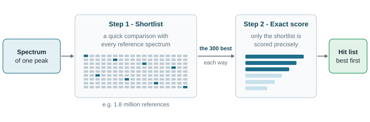
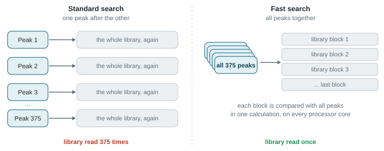
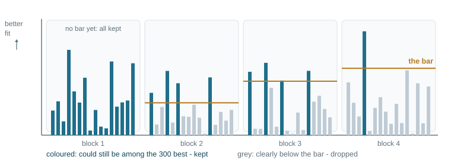

# How the library search works

A library search answers one question for a peak: *which reference spectrum in my libraries looks most like
the spectrum of this peak?* This chapter explains how GC Workspace answers it, why that takes time with large
libraries, and how **Fast search** gets the same answer several times faster.

You do not need this chapter to use the search. It is here so that you can trust the result and know what the
settings change.

## What is compared

Every peak has a mass spectrum: a list of masses (m/z) with their intensities. Every entry of a library is
such a list too, with a name, a CAS number and a formula attached. The search compares the peak's spectrum
with the reference spectra and gives each comparison a **score** from 0 to 99. The best-scoring references
form the **hit list** of the peak; the first hit becomes the peak's name if its score reaches the quality
limit of the search method.

Two ways of scoring are built in. You choose one per search method under **Identify > Search methods...**
in the field **Algorithm**:

| Algorithm | What it is | Score |
|---|---|---|
| **pbm** | Probability Based Matching, the search of Agilent ChemStation. Rare masses and unusually strong ions count more than common ones, because they say more about a substance. | Qual, 0 - 99 |
| **similarity** | The match factor of NIST MS Search: how well the two spectra lie on top of each other, with high masses counting more. | match factor ÷ 10, 0 - 99 |

Each comparison is made in two directions, and the hit list shows both:

- **Forward (Fwd)** - is everything in *my* spectrum explained by the reference?
- **Reverse (Rev)** - are the reference's ions present in my spectrum? Ions that only my spectrum has do not
  count against the reference. That helps when a second substance elutes at the same time and adds its own
  ions.

## The standard search: two steps

Scoring a spectrum precisely takes time. With 1.8 million reference spectra it would take far too long to do
that for every reference. So the search works like looking for a book in a big library: first a quick look
along all shelves to pull out the books that might fit, then a careful read of only those.

1. **Shortlist.** The peak's spectrum is compared with *every* reference in a quick, simple way (forward and
   reverse). The 300 best of each direction go on the shortlist - at most 600 of the 1.8 million.
2. **Exact score.** Only the shortlist is scored precisely with the chosen algorithm. The best of them, sorted
   by score, are the hit list (20 hits unless the search method says otherwise).

When the search method filters the hits - **Name must contain**, **Name must not contain**,
**Only hits with a CAS number** - the shortlist is five times longer (1500 each way), so that enough hits are
left after filtering.

## Why that is slow for a whole chromatogram

Step 1 reads through the whole library for *one* peak. The automatic library search does this for every
integrated peak: 375 peaks mean 375 walks through all libraries. Each walk is quick, but together they are
most of the waiting time.

## Fast search: all peaks in one walk

Fast search asks the questions of all peaks during a single walk through the library.

1. **Blocks.** The libraries are taken in blocks of 16,384 reference spectra. Each block is laid out as a
   table: one row per mass, one column per reference.
2. **One calculation for all peaks.** The spectra of all peaks are laid out the same way, and the two tables
   are multiplied. That single calculation gives the quick comparison of *every peak with every reference of
   the block*. This kind of calculation is what processors are best at, and it runs on all cores of the PC.
   While one block is calculated, the next one is already being prepared.
3. **The bar.** For each peak the program remembers its 300 best references so far. The weakest of them is
   the bar: a reference that is clearly worse than the bar can never make the shortlist, so it is dropped at
   once. The bar rises with every block, and fewer and fewer references have to be kept.
4. **Exact shortlist.** At the end, the few references that stayed in the running are compared again, now with
   exactly the arithmetic of the standard search. From them the 300 best of each direction are taken - the
   same shortlist the standard search would have made.
5. **Exact score, shared.** Step 2 is the same as in the standard search. But neighbouring peaks and the
   second injection of a sample mostly have the same references on their shortlists. Fast search reads and
   prepares each reference spectrum only once and uses it for every peak that needs it. It keeps up to 30,000
   of them in memory, so a second search over the same libraries starts with most of the work already done.

## Why the results are the same

Fast search is faster, not less careful. Three things make sure that hits, scores and their order are exactly
those of the standard search:

- **A safety margin.** The quick calculation in step 2 rounds its numbers slightly differently from the
  standard search. How large that difference can be at most is known. A reference is only dropped when it is
  below the bar by more than twice that amount - so nothing that could belong on the shortlist is lost.
- **The final numbers are the standard ones.** What decides the shortlist and the scores is never the quick
  calculation. It is always the recalculation with the standard arithmetic (step 4) and the standard scoring
  (step 5).
- **Ties go the standard way.** Sometimes the same spectrum is in several libraries, and the copies tie
  exactly at place 300. The standard search then keeps some of them, in no defined order. If such a tie could
  change a peak's hit list, that one peak is simply searched again the standard way.

This was measured on real data: 13 libraries with 1.82 million spectra and 375 peaks of six runs gave
identical results for every peak, at 49 ms per peak instead of 409 ms - about eight times faster. For a single
run of 87 peaks the gain was 4.5 times.

## When Fast search helps, and when it does not

| Situation | What happens |
|---|---|
| **Library search...** over many peaks, one or all loaded chromatograms | Fast search works on up to 400 peaks at a time. The larger the libraries and the more peaks, the larger the gain. |
| Fewer than 8 peaks to search | They are searched one by one: preparing the blocks would take longer than it saves. |
| **Library hit list (selected peak)**, the **Library hits** of the Mass spectrum panel, **Own library** | One spectrum: always the standard search. |
| The automation (watcher) | Uses the search method of the workflow's processing method, with or without Fast search as set there. |
| Little free memory | Fast search needs a few hundred megabytes of memory while it runs. The standard search needs almost none. |

The status bar shows the progress: *Fast search: screening ... peaks against the libraries* during the walk
through the blocks, then *Fast search: scoring ...* while the hit lists are built. **Cancel** stops it; the
peaks finished until then keep their results.

## The settings that matter

All of them are in **Identify > Search methods...** and belong to one search method.

| Setting | What it changes |
|---|---|
| **Speed: Fast search** | Switches the search of many peaks to the way described here. Off for a new method. Results do not change, only the time. |
| **Algorithm** | **pbm** or **similarity** - how the shortlist is scored (step 2). |
| **Library order** | **Combined**: all ticked libraries are searched together and the best hits overall are listed. **Sequential**: the libraries are searched from the top down, and the search stops at the first library that has a hit at or above the stop score. |
| **Stop score (sequential)** | The score that ends a sequential search. 80 unless you change it. |
| **Hits per peak** | How long the hit list is. |
| **Quality limit (identified from)** | The first hit names the peak only from this score on. Below it the peak is reported as unknown or as a possible derivative. |
| **m/z range** | Only ions in this range are compared. **From the acquisition** takes the scan range of the run. |
| **Intensity threshold** | Ions of the peak's spectrum below this value are ignored. |
| **Remove duplicate compounds from the hit list** | The same compound from several libraries is listed once. |
| **Libraries** | Which of your libraries this method searches, and in which order. |

With **Sequential** order, Fast search walks through the first library with all peaks, then through the second
only with the peaks that have not reached the stop score yet, and so on - just as the standard search does
for each peak on its own.
